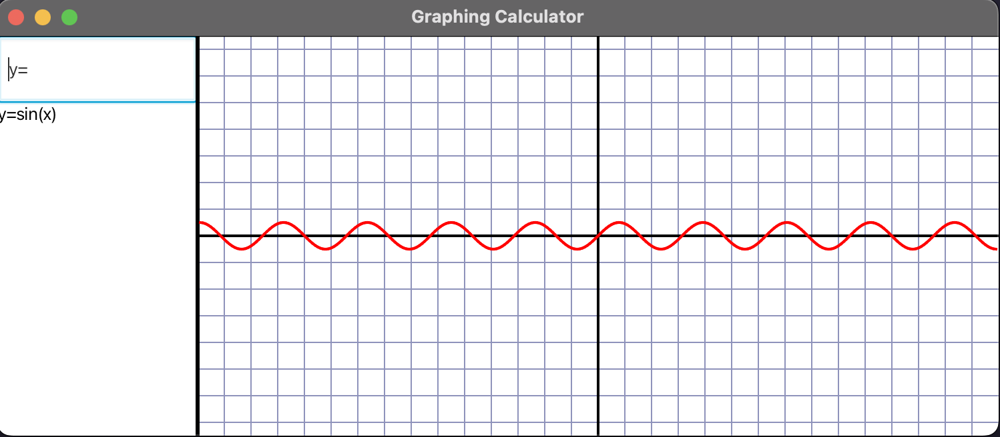
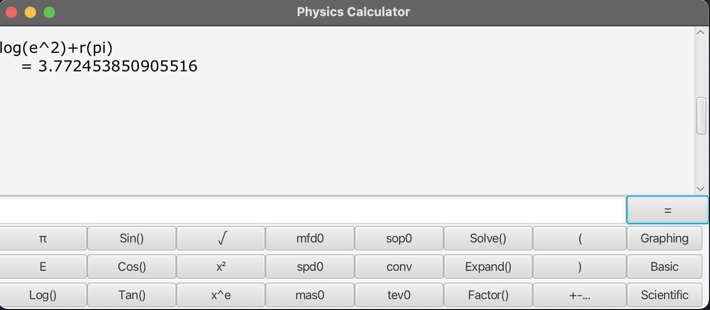

# Graphing Calculator and Physics Toolkit
### <span style="color: red;">WARNING! This is an early rendition and does not have desired graphing outcomes, large reworks to logic are in the process</span> ###


### NOTE: Physics interface is in early testing and the GUI will be reworked

This Graphing Calculator and Physics Toolkit is a versatile Java application that combines the functionality of a graphing calculator with physics-related features. It allows users to perform various mathematical calculations, graph equations, and access predefined physics equations.

## Features

- **Graphing Calculator:**
    - Input and graph mathematical expressions.
    - Plot 2D functions and visualize their graphs.
    - Supports variables and a wide range of mathematical operations.
    - Handle negative numbers and unary negation.

- **Physics Toolkit:**
    - Access predefined physics equations and constants.
    - Perform physics calculations and conversions.
    - Solve physics problems quickly and easily.

## Getting Started

To run the application, you'll need to compile and execute the Java code. Here are the steps to get started:

1. Clone this repository:
  ```
  git clone https://github.com/xKronos58/GraphinCalc.git
  cd GraphinCalc
  ```
2. Compile the Java code:
- **<span style="color: red;">REQUIRES JAVA 20 TO BE INSTALLED</span>**
- `javac com/example/gcalc/Calculator/GCMAIN.java`
 - Or Open the repository inside in IDE like Intelij Idea.
3. Use the calculator and physics toolkit features to perform calculations and graph equations.

## Usage

- **Graphing Calculator:**
- Enter mathematical expressions, e.g., `y = x^2 + 2*sin(x)`.
- Use standard mathematical operators (+, -, *, /) and functions (sin, cos, sqrt).
- Graph the equations and explore their plots.

- **Physics Toolkit:**
- Access predefined physics equations by entering specific codes.
- Perform conversions, calculate terminal velocity, and more.

## Examples

- To graph a function: `y = x^2 + 2*sin(x)`
- To calculate the magnetic flux density: `mfd0` or `mfd1` or `mfd2`
- To convert units: `conv`
- Explore more opening the [Supported Equations](supportedEquationList.md) File

## Contributing

Contributions to this project are welcome. If you have ideas for improvements or new features, feel free to open an issue or submit a pull request.

## License

This project is licensed under the MIT License - see the [LICENSE](LICENSE) file for details.
