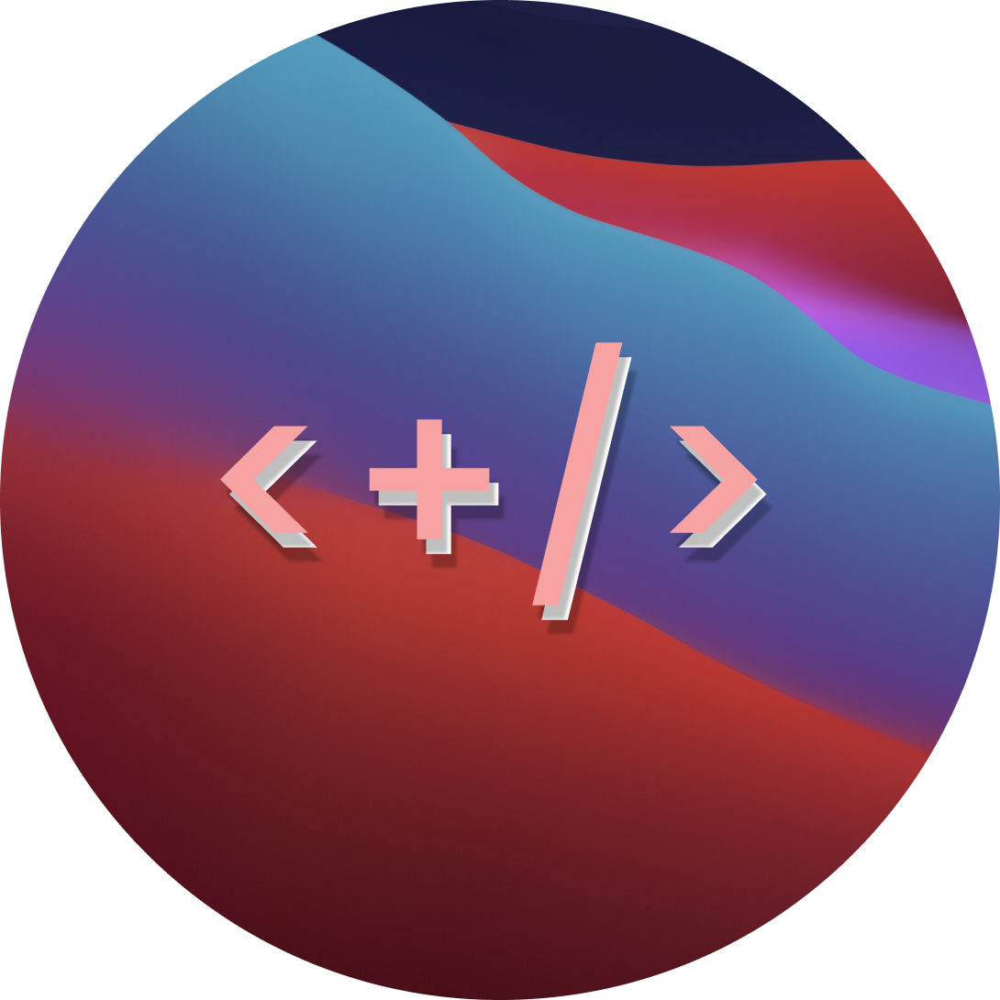

# CHANGE LOG 
### How to use 
See B-0.01.A, B = beta (version), 0 = major iteration, 01 = minor iteration, A = First in patch order

## B-0.03.A-1
Preview of previous changes

## B-0.03.A
- Added Saved equations, allowing you to use the `Up-Arrow` or `Down-Arrow` keys to scroll through previous equations, saving equations from previous sessions.
  - Note it will constantly save equations unless changed in settings (Under general), A new button has been added in the grneral settings to clear the history.
- New File handling methods have been added to `Utils.java` to allow for easier file handling.
  - Including `WriteFile()` & `ReadFile()` & `ClearFile()`

## B-1.02.A
- Added `let[x]=y` function for variable definition. 
  - Usages: `let[a]=12`, `let[b]=a^2`, `b=144`, `9/(pi*b)` will return `0.00198...`
  - Note: `let[x]=y` is not a function, it is a variable definition.

## B-1.01.A
- Fixed Complex numbers so `sqrt(-1)` now renders on the graphing plane. `Complex.java` is still to be implemented inside the calculators to allow for `i` to be used inside calculations. 

## B-1.00.A
- Added `ABSOLUTE_INEQUALLITY()` To the solve function within the `Equation` Enum
- Re-Wrote the `Convert()` Function to start the migration from console based conversion to GUI based conversion.
- Re-Did the `ScientificCalc.fxml` File so that it has the base (To be implemented later)
- Changed the `BasicCalc.fxml` to `CalculusCalc.fxml` and added the base for the calculus calculator
- Added "clear" & "clear type" buttons to the default set of buttons
- Added start of `Let[x]=y` function for variable definition within the calculator. Note currently defining the variable works but using it does not.
- More minor bug fixes inside `HandleStack.java`.
- Cleaned up `GCMain.java` and added more comments
- Added `f(y)` support for graphing to allow for y based graphs to be used like `f(y)=y^2` which creates a parabola along the x instead of the y.
- With the addition of `f(y)` added a method to check if the dots were being rendered on the equation field as previously this was not an issue.
- Added Menus for Constants, Functions & Inequalities using the `remapKeys()` method. 
- Started making the use of different action evens per button obsolete as the `GCController.java` is getting quite large. This will be done through the use of the `Actionevent` being parsed into the method, allowing for the button press to be handled inside a single method. This will also improve clutter and allow for deletion of obsolete methods.
- Started making a `Differentiate()` class to allow for the differentiation of equations. This will be used in the future for the calculus calculator.
- Added support for Scaling the graphs (WIP)
- Fixed the `Constatns.md` to be more up to date as it has not been changed since it was made. 
- Added beginning for Complex Numbers so that negative `sqrt()` graphs and calculations can be done. 
## B-0.07.B 
- Cleaned up and updated `READNE.md`
- Provided new screenshots for application after reworks 
- Fixed minor bug that was not caught with last commit inside the `cqrt[]{}` method as the `()` were changed to `{}` and the application was still searching for `()` to finish the equation.
## B-0.07.A
-  Reworked graph plotting, graphs are now added accurately.
  - NOTE: Graphs that have r() or ^2 are not evaluated correctly in the negatives. Due to an unknown cause 
-  Added detailed comments to the `GCMain.java` class
-  Did some general code cleanup
-  Reworked the `EvaluateGraph()` function now efficiently replaces x and runs the function with updated x value
-  Added accuracy implementations, so izt can now be modified for performance or accuracy. Will be added to settings menu in future, for now is defaulted to `0.01d`
-  Made progress on `Simplify.java` class
## B-0.06.A
-  Added `HCF()` & `LCM()` & `SimplifyQuadratic()`
-  Re-did physics calc button layout. 
- - NOTE functions and constants menus have not been worked on 
-  Added alerts for invalid equations and `errorMessage()` for a predefined error 

## B-0.05.A
-  Added type definition for solve function
-  Added functioning quadratic solving when `solve(t=quadratic(equation=0))`
-  Did work on `Expand.java`
-  Added application icon
#### Below:
' 

## B-0.04.C
-  Started expand rework

## B-0.04.B 
-  Started work on settings
-  General code cleanup

## B-0.04.A
-  Did some general cleanup of code 
-  Removed unused classes
-  Added Base for menus and button popup screens 
-  Added support for equations inside the physics calculator

## B-0.03.C
-  Added inbuilt supported actions for user reference

## B-0.03.B
-  Added support for simultaneous equation solving through the `solve()` function. 
  - Form = `solve(a1x + b1y = c1; a2x + b2y = c2, x)`

## B-0.03.A 
-  Added help menus inside the physics calculations
-  Added ability to render MD and Html code inside application
-  Fixed missing java fx libs

## B-0.02.A
-  Continued with Expand() 
-  Fixed physics calculator equation output rendering

## B-0.01.B
-  Added start to Expand Class
-  Added `HasChar(x, sp)` method

## B-0.01.A
-  Added change log
- ### Extended Constants Lib
    Added Constants.md (List of supported / planned lib constants)

    Added Constants: 
  - Tau
  - phi (Golden Ratio) 
  - Super golden ratio
  - CCHL
  - KBC (Kepler–Bouwkamp constant)
  - WC (Wallis Constant)

-  Added use of Log10 and not just LN
-  Re-Wrote Solve.java

